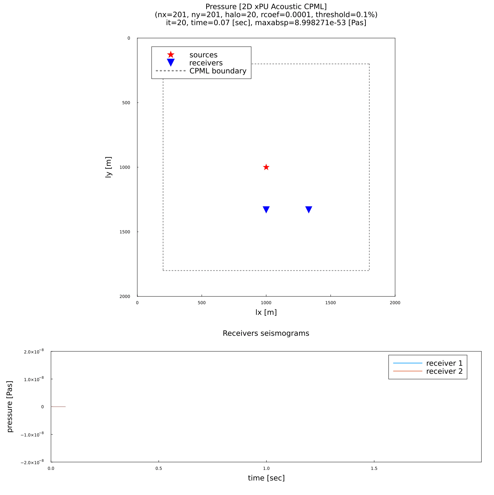
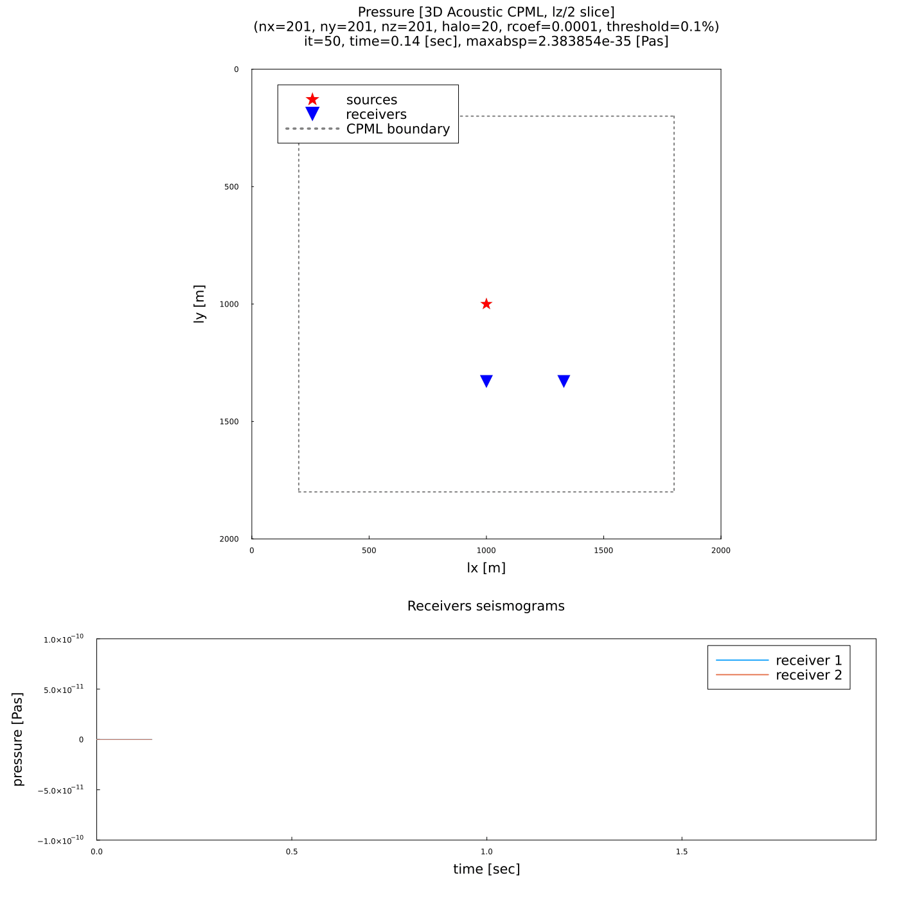
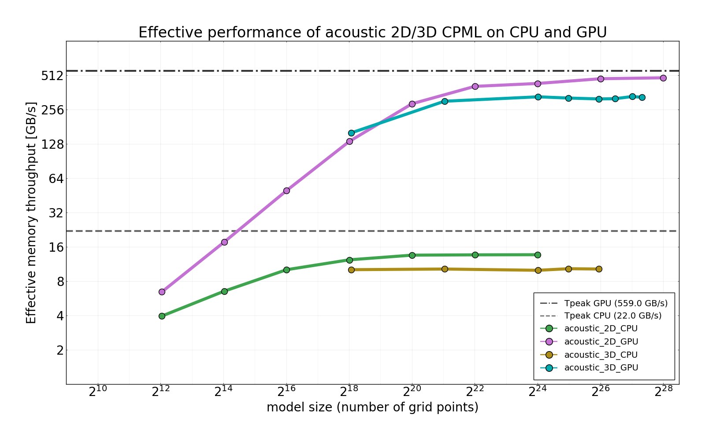

# AcousticWaveCPML.jl

A Julia package for solving acoustic wave propagation in 2D and 3D on multi-xPUs using CPML boundary conditions.

## Introduction and motivation

Seismic tomography is the predominant methodology geoscientists use to investigate the structure and properties
of the inaccessible Earth’s interior. Inferring properties of the subsurface from seismic data measured on
the surface of the Earth, i.e., solving the tomographic inverse problem, requires the simulation of the physics of
wave propagation (the forward problem).

The forward problem can be solved numerically by suitable methods
for PDEs (boundary value problems). These methods quickly become computationally expensive when a fine
discretization of the subsurface is needed and/or when working with 3D models. Because of that, exploiting
parallelization and computational resources is crucial to obtain results in a reasonable amount of time, allowing
for the solution of the inverse problem.

In particular, GPUs are becoming increasingly employed to speed-up
computations of finite difference methods, because of the regularity of their computation pattern.

Currently, there is a lack of availability of open source software packages combining easiness of use, good
performance and scalability to address the above-mentioned calculations. The Julia programming language is
then a natural candidate to fill such a gap. Julia has recently emerged among computational physicists because
of a combination of easiness of use (reminiscent of languages like Python and MatLab) and its speed. Moreover,
Julia natively supports several parallelization paradigms (such as shared memory, message passing and GPU
computing) and recently developed packages like [ParallelStencil.jl](https://github.com/omlins/ParallelStencil.jl) and [ImplicitGlobalGrid.jl](https://github.com/eth-cscs/ImplicitGlobalGrid.jl), which make for a simple, yet powerful, way to implement scalable, efficient, maintainable and hardware-agnostic parallel algorithms.

We have implemented some time-domain finite-difference solvers for acoustic wave propagation
with CPML boundary conditions on GPUs using Julia. Extensive [benchmarks and performance evaluations](#performance-evaluation) of the developed parallel code have been conducted to assess the gain in performance and the possibility to scale on multi-GPUs.

## Physical model

The main PDE to solve is the classical acoustic wave equation:

$$
\frac{\partial^2 p}{\partial t^2} = c^2 \nabla^2 p,
$$

where $p$ is the pressure and $c$ is the wave propagation velocity (i.e. speed of sound). We consider from now on the pressure term $p$ to be the difference from lithostatic pressure. Hence we consider initial values for pressure as $p(x,0) = 0$.

If we also consider a source term $s(x,t)$ the eqaution becomes:

$$
\frac{\partial^2 p}{\partial t^2} = c^2 \nabla^2 p + s
$$

Consider some rectangular area of space $\Omega \in \mathbb{R}^n, n = 1, 2, 3$. Consider also a final time $T$ at which we end our simulation. Then we choose an appropriate boundary condition on the boundary $\partial \Omega$ of $\Omega$ and we have a boundary value problem we can solve on the space-time set $\Omega \times [0,T]$.

If we choose a free boundary condition (i.e. a homogenous Dirichlet BDC), we get the following BVP:

$$
\begin{align*}
\frac{\partial^2 p}{\partial t^2} &= c^2 \nabla^2 p + s &&,~ \text{in}~ \Omega &&\times [0,T] \\
p &= 0 &&,~ \text{in}~ \partial \Omega &&\times [0,T] \\
\end{align*}
$$

### CPML boundary conditions

Free boundary condition conditions have the issue of creating reflection waves from the boundary, hence they are not suitable for inverse problems forward solvers. One of the possible "solutions" is to run the simulation on a much bigger model and prescribe a final time $T$ so that all reflections from the velocity model itself are recorded at some receivers but no spurious reflections from the boundaries have reached the receivers yet. This is of course computationally expensive, hence motivating the need for _absorbing_ boundary conditions like CPML BDCs.

The main concept of CPML BDCs is to enhance the standard wave equation at the boundaries with additional terms $\psi_i$ and $\xi_i$ that are used to damp the waves:

$$
\frac{\partial^2 p}{\partial t^2} = c^2 \left( \nabla^2 p + \left( \frac{\partial \psi_i}{\partial i} \right) + \xi_i \right),~ \text{in}~ \tilde{\partial}_i \Omega \times [0,T]
$$

where $i$ is used as Einstein notation to denote the various dimensions (e.g. $i \in \{x,y,z\}$ in 3D) and $\tilde{\partial}_i \Omega$ denotes an extension of $\partial \Omega$ in the $i$ dimension to create a boundary layer composed by some number of "extra" nodal points.

These two new fields $\psi_i$ and $\xi_i$ evolution in time is expressed by the following PDEs:

$$
\begin{align}
\psi^n_i &= \frac{b_i}{K_i} \psi^{n-1}_i &&+ a_i \left( \frac{\partial p}{\partial i} \right)^n, \\
\xi^n_i &= \frac{b_i}{K_i} \xi^{n-1}_i &&+ a_i \left[ \left( \frac{\partial^2 p}{\partial i^2} \right)^n + \left( \frac{\partial \psi}{\partial i} \right)^n \right],
\end{align}
$$

where $n$ is an index that represents the current time step, not a power exponent. Initialization of the fields is straightforward:

$$
\psi^0_i = 0, \xi^0_i = 0, \forall i~ \text{in}~ \tilde{\partial} \Omega
$$

The coefficients $a_i, b_i, K_i$ are computed in the following way:

$$
\begin{align*}
K_i(x) &= 1 + (K_{max} - 1)d_i^N(x), \\
b_i(x) &= \exp(- \Delta t (D_i(x) + \alpha_i(x))), \\
a_i(x) &= D_i(x) \frac{b_i(x) - 1.0}{K_i(x) (D_i(x) + K_i(x) \alpha_i(x))}
\end{align*}
$$

and

$$
\begin{align*}
D_i(x) &= \frac{-(N + 1) \max(c) \log(R)}{2t_i} d_i^N(x), \\
\alpha_i(x) &= \alpha_{max}(1 - d_i(x)),
\end{align*}
$$

where:
- $t_i$ is the thickness (in meters) of the CPML boundary in dimension $i$,
- $N$ is a power coefficient (we used $N=2$),
- $f$ is the dominating frequency of the source $s$,
- $d_i(x)$ is the normalized distance (between $0$ and $1$) from $x$ to the interior part $\overline{\Omega}$ of $\Omega$ in dimension $i$.

We picked some experimentally determined coefficients from reference studies of CPML BDCs on the acoustic wave equation (see [[1](#references)] and [[2](#references)]). These are the following:
- $K_{max} = 1$
- $\alpha_{max} = \pi f$
- $R = [0.01, 0.001, 0.0001]$ for $[5, 10, 20]$ number of extra CPML nodal points respectively.

One crucial observation is that each component of the $\psi_i$ and $\xi_i$ fields is non-zero only in the boundary incident to its dimension (i.e. $\psi_x$ is only non-zero in the $x$-direction boundaries). This simplifies the equations in most of the boundary regions: the full equation needs to be computed only for boundary corners.

The full set of equations with boundary conditions then becomes:

$$
\begin{align}
\frac{\partial^2 p}{\partial t^2} &= c^2 \nabla^2 p + s &&,~ \text{in}~ \overline{\Omega} &&\times [0,T], \\
\frac{\partial^2 p}{\partial t^2} &= c^2 \left( \nabla^2 p + \left( \frac{\partial \psi_i}{\partial i} \right) + \xi_i \right)&&,~ \text{in}~ \tilde{\partial}_i \Omega &&\times [0,T], \\
p &= 0 &&,~ \text{in}~ \partial \Omega &&\times [0,T]
\end{align}
$$

## Numerical methods and implementation

We used the most simple finite-difference scheme: second order explicit FD schemes for both space and time. We stagger the $\psi_i$ field in between grid nodal points in $\tilde{\partial}_i \Omega$ and place $p, c, \xi_i$ fields in nodal points ($\xi_i$ only present in $\tilde{\partial}_i \Omega$).

We split time step computations into two substeps:
- first we update the $\psi_i$ fields,
- then we update the $\xi_i$ and pressure fields at the same time.

This separation is crucial to ensure that the $\psi_i$ fields are computed before updating $\xi_i$ and pressure. Note that, since every $\psi_i$ field in each dimension $i$ is independent of each other and only uses pressure derivatives in the direction of incidence of $\tilde{\partial_i} \Omega$, we do not have any inter-dependencies between different $\psi_i$, so we can compute each of them in parallel (e.g. on different CUDA streams).

## Results

We have run several simulations in 1D, 2D and 3D to ensure qualitative and quantitative analysis of CPML boundary conditions in various setups. In this section, we briefly explain the setups used.

### Comparisons against analytical solutions

Since solutions for constant velocity models with one point source are known (see [[5](#references)]), we first compared numerical solutions with analytical ones.

We tested two scenarios:
- no CPML layers with a cut final time to not get reflections,
- 20 CPML layers with a bigger final time to test for appropriate damping.

For the source terms, we always use a Ricker wavelet source (second derivative of a Gaussian) to simulate an "impulse" source.

We recorded the pressure trace at a receiver placed at a fixed distance from the source and compared it to the analytical solution to verify for correctedness. You can find these tests under the `test` folder for each version.

### Setups

We have mainly three types of setups:
- constant velocity models with a single source located in the center and CPML layers in all boundary regions;
- gradient velocity (directly proportional to depth) with multiple sources located at the top of the model and **NO** CPML layers on the top boundary (to simulate free top boundary conditions).
- complex velocity model (from [[3](#references)]) with multiple sources located at the top of the model and **NO** CPML layers on the top boundary.

We use different configurations of CPML layers (0, 5, 10 or 20 layers in each boundary) with different reflection coefficients (these are shown in the animation plots).

We record traces at some selected positions to observe the damping effect of CPML BDCs.

### 1D CPML

For the 1D simulations, we show a simple constant velocity model with 201 grid points and one source in the center. The animations for different CPML layers thicknesses are shown below:

|                          |                       |
:-------------------------:|:-------------------------:
| CPML layers = 0            |  CPML layers = 5       |
  |  
| CPML layers = 10            |  CPML layers = 20       |
  |  

We can see that without CPML layers, the wave gets reflected at the boundaries. Starting to add CPML layers, the wave gets absorbed by the boundaries, the more layers the less spurious oscillations we get back to the source.

### 2D CPML

#### Constant velocity model

In these simulations we tested the 2D CPML solver by looking at spurious reflection waves coming from the boundaries using different amounts of CPML layers. We use a threshold to cut low pressure values.

We show the maximum absolute pressure value in the whole field to see how much of the wave dissipates after hitting the boundaries.

|                          |                       |
:-------------------------:|:-------------------------:
| CPML layers = 0            |  CPML layers = 5       |
  |  
| CPML layers = 10            |  CPML layers = 20       |
  |  

We can see that, as in the 1D case, adding more layers helps with reducing the amplitude of the reflected waves.

#### Gradient velocity model

In this simulation we wanted to tackle a non-constant velocity model, but still pretty simple. The velocity is shown in the plots as a grayscale gradient in the background, with higher values corresponding to darker colors. As usual, we compare different CPML layers amounts. We use a bigger pressure threshold to cut more low pressure values and only see the "main wavefronts". Here we still should not see any reflections coming from velocity differences, since the gradient is pretty smooth and for those we would need sharper shocks.

|                          |                       |
:-------------------------:|:-------------------------:
| CPML layers = 0            |  CPML layers = 5       |
  |  
| CPML layers = 10            |  CPML layers = 20       |
  |  

#### Complex velocity model

Here we investigated a complex velocity model from [[3](#references)] to see how the code behaves with reflections from the model itself. Here note that we used quite a high threshold for pressure shown in the animations.

|                          |                       |
:-------------------------:|:-------------------------:
| CPML layers = 0            |  CPML layers = 20       |
  |  

We compare the models with and without CPML layers and see that we get quite good results: the waves are mostly absorbed and the maximum absolute pressure value decreases after all waves reach the boundaries.

### 3D CPML

For 3D simulations, we mostly wanted to make sure that the code behaved similarly to the 2D code. We plot a slice of the model at $z = nz/2$ to compare behavior with 2D versions and also a 3D isometry visualization.

#### Constant velocity model

| CPML layers = 0         | |
:-------------------------:|:-------------------------:
| 2D nz/2 slice            | 3D isometry |
  | 

| CPML layers = 20         | |
:-------------------------:|:-------------------------:
| 2D nz/2 slice            | 3D isometry |
  | 

#### Gradient velocity model

|         | |
:-------------------------:|:-------------------------:
| 2D nz/2 slice            | 3D isometry |
  | 

#### Complex velocity model

This complex velocity model has a quite high resolution, so we ran this using multiple GPUs on [Piz Daint](https://www.cscs.ch/computers/piz-daint/). The simulation was fairly quick (8000 timesteps in 30 seconds), but it produced a lot of data that then needed to be post-processed for visualization.

We can see a bunch of reflections from the velocity differences in the model, but at some point all waves are mostly absorbed.

## Performance evaluation

In this section we show performance evaluations of the 2D and 3D implementations run on both CPUs and GPUs.

We are interested in assessing the effective memory throughput `Teff` [GB/s], which measures the amount of data that needs to be loaded/stored for the computation to be performed. It is computed similarly for 2D and 3D versions by analyzing the code structure and counting each field that gets only loaded once and each field that gets loaded and updated twice. Why don't we look at floating point operations per second? Because the computation we have to perform is memory-bound, so using a metric for compute-bound operations would be unfair since we could never reach peak performance that way.

We also do a weak scale analysis for the multi-xPU implementations to see if we scale well on multiple nodes.

### Benchmarking setup

GPUs benchmarks were run on Piz Daint Cray XC50 Compute Nodes, each of them with an NVIDIA® Tesla® P100 16GB, peak bandwidth measured with a triad benchmark (around 559 GB/s), Julia version 1.7.2.
    
CPUs benchmarks were run on a MacBook Pro 2017 laptop, equipped with an Intel(R) Core(TM) i7-7660U CPU @ 2.50GHz with 2 physical cores, peak bandwidth measured with [STREAM](https://www.cs.virginia.edu/stream/) (around 22 GB/s), Intel Turbo Boost disabled while running. Julia version 1.8.1.

### Performance of 2D and 3D kernels

Here we plot the effective memory throughput for 2D and 3D implementations on both a 2-core CPU and a single GPU, as a function of increasing model size (in the number of grid points).

Each measurement (i.e. point in the plot) was conducted using the `@belapsed` macro of the [BenchmarkTools]() toolkit. This means that we measure multiple times and we take the minimum of all the measurements. We also perform a statistical analysis of the set of runs by computing the 95% confidence interval and checking that this interval lies inside the +-5% of the median. This ensures that random noise is not affecting the measurements too much.

We can see that the performance on the GPU gets better as soon as the problem size is big enough, and then we get a plateau. On the contrary, big models do not perform as well on the CPU because of a slower memory bandwidth. For the 2D computation, we reach around 87% of GPU peak performance, while for 3D we reach around 60%. This is expected, since the GPU memory pattern and threads scheduling is not optimized for 3D computations.

### Weak scaling of 2D and 3D multi-xPU kernels

Here we investigate if our code can be used to run bigger models on multiple xPUs in the same amount of time as smaller models on a single xPU. We only measure GPUs on multiple Piz Daint nodes, since the availability of a fast network is essential to get good scaling across multiple nodes.

We use as baseline time the best one that was measured for a single node computation.

For these measurements we use a different approach: we run some timesteps, starting to measure time after the first bunch of them, and then return the time it took to run the remaining ones. For 2D we run 1000 timesteps and skip the first 200, for 3D we run 100 timesteps and skip the first 19. Also, the starting model size for 2D is $16385 \times 16385$, while the starting 3D model size is $513 \times 513 \times 513$. 

We can see that we obtain a very high and stable weak scaling efficiency at around 95.8% for 2D and around 99.5% for 3D, at least for the amount of nodes that we could measure.

**CAVEATS**: benchmarks were performed using the `@hide_communication` macro of ImplicitGlobalGrid with factors `(2,2)` and `(2,2,2)` for 2D and 3D multixPUs versions, which is not currently supported because module precompilation breaks if used in combination with ParallelStencil. You can use this feature by importing and initializing ParallelStencil and ImplicitGlobalGrid before including the source file containing the solver you want to use. Then you can uncomment the lines with `@hide_communication` and also specify with the parameter `b_width` its argument.

## Conclusions

We have shown that it is possible to solve acoustic equation with finite differences on GPUs in both 2D and 3D models efficiently.

We can scale the model size arbitrarily by distributing computation onto multiple GPUs (we need to have them available though! also costly to use a big number of GPUs on Piz Daint)

CPML boundary conditions seem to work pretty well, at least for ricker wavelet sources with a specific frequency. Comparing our solver with other ones that are known to be correct is one of the next steps.

_WIP: functionalities to compute gradients with respect to velocities using the adjoint method and residuals from available data and checkpointing features._

## References

[1] [An unsplit convolutional perfectly matched layer improved at grazing incidence for the seismic wave equation
Komatitsch, Dimitri et al.
GEOPHYSICS (2007),72(5): SM155](https://library.seg.org/doi/10.1190/1.2757586)

[2] [Convolutional perfectly matched layer for isotropic and anisotropic acoustic wave equations, Pasalic et al., SEG Technical Program Expanded Abstracts 2010](https://library.seg.org/doi/abs/10.1190/1.3513453)

[3] [SEG/EAGE Salt and Overthrust Models](https://wiki.seg.org/wiki/SEG/EAGE_Salt_and_Overthrust_Models)

[4] [Piz Daint](https://www.cscs.ch/computers/piz-daint/)

[5] [Computational Seismology: A Practical Introduction, Heiner Igel, Oxford University Press 2016](https://academic.oup.com/book/26503)

# Appendix

Here is written some information on documentation and how to use the scripts to reproduce results.

## Documentation

- [STABLE]() **no stable documentation as of now**.
- [DEVEL](https://giackaloz.github.io/AcousticWaveCPML.jl/) _documentation of in-developement version_.

## How to reproduce results

We provide ready-to-use scripts to run simulations shown in this README. The scripts are inside the `script` folder and are called `run_<solver_version_here>.jl`. They run the same setups that we described (and some more). You can take inspiration from those scripts to run your own models and simulations configurations.

We also provide some scripts for running benchmarks. You can find these in the `scripts/benchmarks` folder. We also have scripts for plotting benchmarks in this folder. Data collected from performed benchmarks is here too.

We also provide submissions script for Piz Daint in the `submit_daint` folder. Here you can find various scripts for submitting jobs on the Slurm queue and some results from our runs. There is data to use for weak scaling efficiency plots here.

_REMEMBER: If you wish to run multi-xPUs implementations, you should use your own `mpiexecjl`_